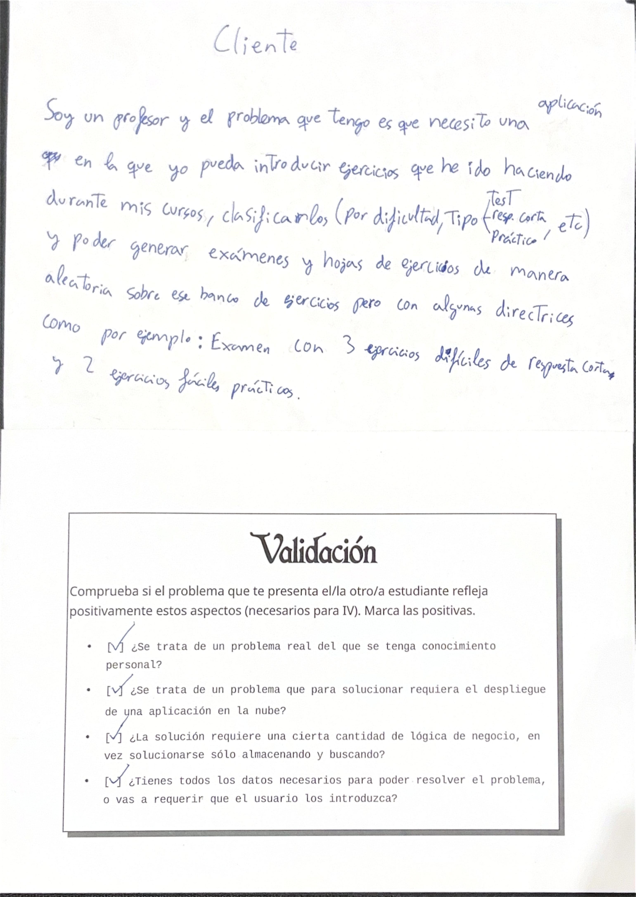

# Mixamen

## Problema a tratar

El profesorado de distintas etapas académicas acumula a lo largo de los cursos cientos de ejercicios, problemas prácticos y preguntas de examenes dispersos en múltiples documentos de texto, hojas sueltas y archivos individuales. 

Esta falta de un sistema unificado de almacenamiento y catalogación dificulta localizar enunciados por criterios específicos (como temática concreta, nivel de dificultad, tiempo estimado de resolución o soluciones disponibles). Como consecuencia directa, la tarea de componer un examen equilibrado —que cubra equitativamente los contenidos y ajuste la carga temporal de la prueba— consume una cantidad desproporcionada de tiempo y resulta propensa a descompensaciones o a la repetición involuntaria de preguntas ya utilizadas con anterioridad.

## Conocimiento personal

Este problema viene de una charla que tuve con mi tía que es profesora. Ella lleva ya unos años dando clases de matemáticas en cursos de la ESO. Me contó que el principal problema que tenía no eran los niños, sino su caótica estructura de organización en cuanto a los ejercicios que he contado ya en el apartado anterior.

## Por qué requiere un despliegue en la nube

Hay varias razones por la que este problema necesita ser desplegado en la nube. La primera es por las restricciones de instalación en centros educativos, el la mayoría de centros ya sean públicos, privados o concertados los profesores no pueden instalar las aplicaciones o programas que quieran y suelen ser bastante restrictivos. La segunda razón es porque muchos profesores tienen que trabajar con varios ordenadores, suelen tener su ordenador personal donde tienen la mayoría de sus ejercicios pero también necesitan acceder a esos ejercicios desde los ordenadores de los centros para bien exponerlos en clase, mandarlos a imprimir, etc.

## ¿Cómo se obtienen los datos? 

Los datos de este problema provienen directamente del material que los profesores ya poseen. En términos generales estos ejercicios residen en archivos PDF o documentos que pueden pasarse a ese tipo de archivos sin mucho problema (.docx, .txt, .md, etc). 

## ¿No se solucionaría simplemente almacenando y buscando?

No, para empezar estaría el generado de exámenes, además, para extraer los ejercicios de los PDF's (porque en la mayoría de los casos un PDF contiene un conjunto de ejercicios, no uno solo) hay necesariamente que procesarlos para separarlos en ejercicios individuales.

## Fotografía de las tarjetas de rol

## Enlaces
* [Documentación adicional y de configuración](doc/objetivo0.md)
