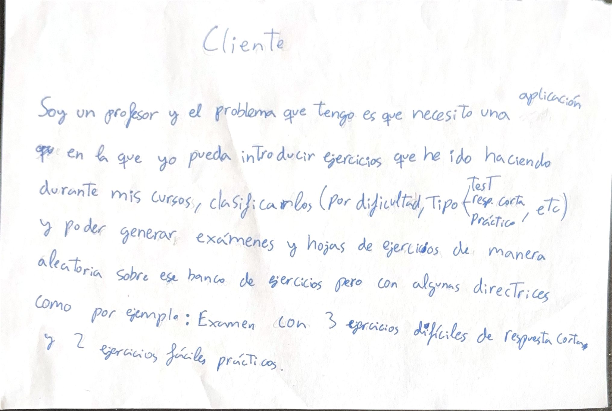

# Mixamen

Prácticamente todo profesor, sin importar la etapa académica en la imparte clase ni la materia, tiene dos problemas comunes. El primero es **organizar** y **guardar** de manera clara todos esos **ejercicios** que ha ido creando durante su carrera y el segundo es **crear** un **examen** **equilibrado** y **a su gusto** en base a esos ejercicios.

Con el fin de ofrecer una solución fácil e intuitiva a estos problemas nace **Mixamen**, donde se podrá guardar y clasificar cada uno de los ejercicios subidos por el profesor para poder así acceder a ellos de manera fácil y a su vez para generar examenes a su gusto.

* [Documentación de configuración adicional](doc/configuracion.md)
